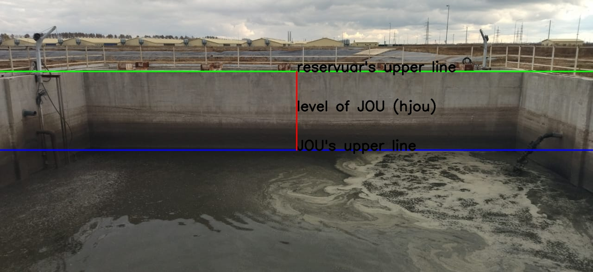

# JOU_Mask_RCNN
Тестовое задание 1 на вакансию ``CV Engineer`` в компанию ``"Русагро_технологии"``.

# Описание задачи

В агропроме вам предстоит работать с грязными данными в самых разных смыслах. В папке ``images`` несколько фото резервуаров с ЖОУ (жидкие органические удобрения). Попробуйте предложить решение и реализовать его в коде, позволяющее определять линию уровня поверхности жидкости.
Это могло бы помочь в задаче определения объема ЖОУ в резервуаре.
Мы также оценим вашу критику и предложения по подходу к решению данной задачи, выходящие за рамки вашего времени на решение домашнего кейса.

# Решение задачи

Я остановился на сегментации поверхности ЖОУ и стен резервуара для ЖОУ с помощью нейронной сети ``Mask RCNN Resnet50``. Вычислении контуров ограничивающих их маски сверху. Далее по каждому ограничивающему маски сверху контуру вычисляется медиана всех значений y-координаты и мы получаем границу определяющую уровень ЖОУ (``y_jou``) и верхнюю границу резервуара для ЖОУ (``y_res``). Уровень ЖОУ относительно стенки резервуара (``h_res``) вычисляется как

$h_{res} = y_{res} - y_{jou}$

Ниже показан пример того как это выглядит на картинке из тестовой выборки:

# Оценки обученной модели на тестовом датасете по метрикам MS COCO

рассчитаем метрику AP, detectron2 имеет ее встроенную поддержку через COCO API.

по рамкам получаем:

| category   | AP     | category   | AP     |
|:-----------|:-------|:-----------|:-------|
| JOU        | 98.218 | block      | 86.735 |

по маскам получаем:

| category   | AP     | category   | AP     |
|:-----------|:-------|:-----------|:-------|
| JOU        | 98.317 | block      | 90.000 |

Поверхность ЖОУ и по рамкам и по маскам распознается отлично!
Поверхность стенок резервуара, уже хуже. Примечательно, что по маскам все же лучше.

Чтож, отличный результат для обучающей выборки, состоящей из всего 5 картинок =)
(правда еще Flip'нутых, что увеличивает их до 15-ти).

Правда и test состоит тоже всего из 4-х.
(правда еще Flip'нутых, что увеличивает их до 12-ти).